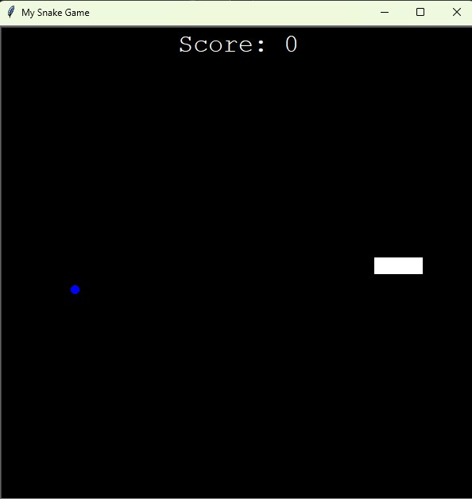

# OG Snake Game



Classic Snake Game built with Python's Turtle module.

## How to Run

```bash
python main.py
```

## Controls

- **Arrow Up** — Move up
- **Arrow Down** — Move down
- **Arrow Left** — Move left
- **Arrow Right** — Move right

## Features

- Snake grows when it eats food
- Score tracking
- Game over on wall or tail collision
